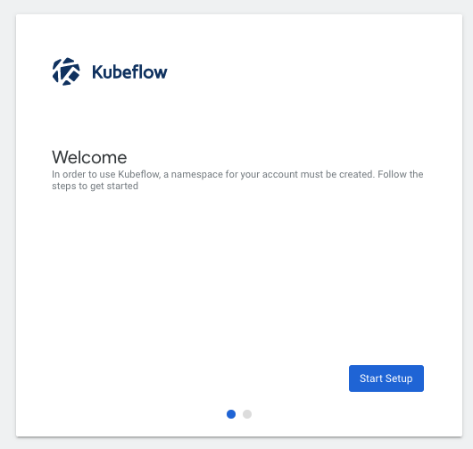

# Sample Kubeflow Codes

kubeflowのサンプルパイプライン（入力された2値を加算する処理）をローカルのDocker for Desktopで動かすまでの手順をまとめたリポジトリとなります。

## Environment

検証した環境は下記となります。
* mac OS BigSur
  * cpu : 2.3GHz 8個
  * memory : 32GB
* Docker Desktop : version 4.0.0
  * Docker Engine : 20.10.8
  * kubernetes : 1.29.2
* kubeflow : [v1.3](https://github.com/kubeflow/kubeflow/releases/tag/v1.3.0)
  * kfctl : [v1.2](https://github.com/kubeflow/kfctl/releases/tag/v1.2.0)
  * kustomize : [v4.3](https://github.com/kubernetes-sigs/kustomize/releases/tag/kustomize%2Fv4.3.0)

## Setup for creating Kubeflow environment in local machine(mac)

kubeflowを構築する前の準備を行います。

### ・install Docker for Desktop

手元のローカルマシン（mac）にDocker for Desktopをインストールします。<br>
詳細は[こちら](https://docs.docker.com/desktop/mac/install/)を参照。

### ・Update cpu, memory and disk limitation on Docker Desktop

Dockerで利用できるリソース量（CPU, memory, Diskサイズ）をアップデートします。<br>
※kubeflowの環境を作る際にかなりのリソースを消費するため。<br>

下記のように上限を設定しました。

* CPU : 6
* Memory : 14GiB
* Disk Image Size : 59.6GiB

### ・enable kubernetes on Docker Desktop

kubernetes（以下k8s）をDocker Desktop上で有効化します。<br>
詳細は[こちら](https://docs.docker.com/desktop/kubernetes/)を参照

### ・install kubectl

Docker for Desktopでk8sを有効にしたタイミングで、kubectlもインストールされる。

### ・install kfctl

kubeflowをk8s上に構築するために、kfctl（kubeflowのコマンドラインツール）をインストールします。<br>
今回は現時点で最新版のv1.2をインストールします。

* [kfctlのリリースページ](https://github.com/kubeflow/kfctl/releases/tag/v1.2.0)から、kfctl_v1.2.0-0-gbc038f9_darwin.tar.gzをダウンロード
* 圧縮ファイルを解凍する（コマンドだと下記）

```
tar -xvf kfctl_v1.2.0-0-gbc038f9_darwin.tar.gz
```

* kfctlのバイナリファイルに対して、パスを通す

```
export PATH=$PATH:<kfctlのバイナリファイルのフォルダ>
```

* kfctlのパスが通ったかを確認（kfctl helpでkfctlのヘルプ情報が表示される）

### ・install kustomize

kubeflowをローカルで構築する際に利用する（はず）ため、インストールします。<br>
※環境差分（本番、開発など）ごとの設定ファイルを構築する際に使われます。<br>

* kustomizeのバイナリファイル（v4.3）を取得
  * [こちら](https://github.com/kubernetes-sigs/kustomize/releases/tag/kustomize%2Fv4.3.0)のkustomize_v4.3.0_darwin_amd64.tar.gzをダウンロード
* 解凍し、バイナリファイルを任意の場所に格納後に、パスを通す
* kustomizeのパスが通ったかを確認(kustomize helpを実行)

## Create Kubeflow environment in local machine(mac)

### ・setup kubeflow environment

kubeflowのコンポーネントをk8s上に構築し、kubeflowのダッシュボードにアクセスできるようにします。<br>

* kubeflowのコンフィグファイルを設定

```
$ export CONFIG=https://raw.githubusercontent.com/kubeflow/manifests/v1.2-branch/kfdef/kfctl_k8s_istio.v1.2.0.yaml
```

* kubeflowを構築
  * 構築には数十分程度かかります。

```
$ kfctl apply -f ${CONFIG} 
```

kubeflowの環境が出来たかは、podsの立ち上がり状態を見れば良いです。<br>
※namespaceが複数できるため、namespace = Allにして、podsをリスト表示します。

```
$ kubectl get pods -A
```

namespaceがkubeflow, istio-system, knative-serving, cert-managerが存在し、一通りpodが立ち上がっていればOKです。<br>
※立ち上がっている = statusがrunningになっている

* kubeflowのダッシュボードにアクセスできるように設定
  * ホストマシン側のポート（7777）は任意の空いているポートを設定してください。

```
$ kubectl port-forward svc/istio-ingressgateway -n istio-system 7777:80
```

* ダッシュボードにアクセスしてみる
  * http://localhost:7777 にアクセスして、下記のような画面が表示されればOKです。



* kubeflowのサンプルプロジェクトの作成

kubeflowのアプリ用のプロジェクトを作成します。<br>
先ほどのダッシュボードページ経由でアプリ用のnamespaceを作成します。（下記の画面）


## Run notebook sample to create the kubeflow pipeline file

kubeflowのサンプルパイプラインを構築するために、[notebook](sample_kubeflow_pipeline.ipynb)の処理を実行します。

* [kubeflow SDK](https://www.kubeflow.org/docs/components/pipelines/sdk/sdk-overview/) をインストールする
  * pip install kfpでインストールが可能です。
* notebookの処理を実行する
  * test_pipeline.yamlがルートフォルダ上に作成されます。

## Run the pipeline

作成したパイプライン処理を、kubeflow上で実行します。<br>
ダッシュボード経由で処理が完結します。

### ・upload the pipeline file

構築したyamlのアップロードを行い、パイプライン情報を登録します。

* 下記画面の「Uplode a pipeline」を選択


* 下記画面の「upload pipeline」を選択


* 下記画面で、パイプライン情報を入力（先ほど構築したtest_pipeline.yamlをファイルとしてアップロードする）


* パイプライン情報が正常に読み込まれると下記のような画面が表示される。


### ・create experiment

パイプラインを実行するためにexperiment（実験）情報を設定します。

* パイプライン情報を表示した画面で、「Create experiment」を選択
* 下記画面で、experimentの情報を設定


### ・run pipeline

パイプライン処理を実行します。

* 下記画面で、パイプラインの入力情報（今回は入力値となるa, bを設定）を設定


* 少し（10数秒くらい）すると、処理が完了します（実験一覧や実行したパイプライン結果画面で状況が確認できます）


## Delete the kubeflow environment

kubeflow環境の削除手順を記載します。<br>
kubeflow環境はずっと稼働させるとメモリやCPUをかなり消費（メモリ20GiB、CPUを6コア100%くらいとか）するので、使わない場合は環境を一旦削除するのをおすすめします。

### ・delete the kubeflow environment

下記コマンドでkubeflow環境（構築したpodsやnamespaceなどを削除する）を削除します。<br>
※削除には数十分程度かかります。

```
$ kfctl delete -V -f ${CONFIG}
```

下記コマンドでpods一覧を確認したときに、kubeflowなどのnamespaceが削除されていれば、正常に削除されています。

```
$ kubectl get pods -A
```

## Other Topic

### パイプライン処理が正常に完了した際のpodsの一覧

以下のように、アプリ用のサンプルプロジェクトのnamespace上で、パイプライン用のpodsの処理が正常に完了していることが見れます。

```
$ kubectl get pods -A
```


### kubeflow環境が削除できない場合

下記のエラーが出て、kubeflow環境が構築できない場合は、manifest（yamlファイル）を修正する必要があります。
```
$ Error: couldn't delete KfApp:  (kubeflow.error): Code 500 with message: kfApp Delete failed for kustomize:  (kubeflow.error): Code 400 with message: cluster name doesn't match: KfDef() v.s. current-context(docker-desktop)
```
k8sのcluster nameが上手くyamlに設定されない場合に発生する問題です。（docker for desktopのk8sを使う場合は、cluster nameがdocker-desktopになっている）

kfctl applyコマンドを実行した際のディレクトリに、kfctl_k8s_istio.v1.2.0.yamlが作成されいるはずですが、このマニフェストファイルのmetadataに下記を追記します。

```
clusterName: docker-desktop
```

上記追記後、再度kfctl deleteを実行してみてください。
